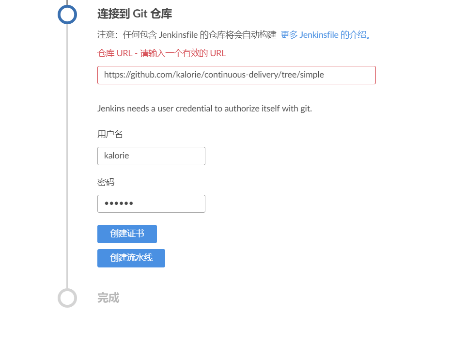

# 概述

基于单一主干分支策略的CI验证项目，该项目仅有一个控制器，用于接受两个输入参数进行加法运算，然后将结果保存到MySQL数据库中。

重点在于需要使用Docker，并结合Jenkins进行相关构建和测试，目标是每次代码提交将自动触发构建任务。

# 步骤

## 安装Gradle插件

通过Jenkins的管理界面进行安装，或者运行Jenkins提供的`install-plugins.sh`脚本：

```
install-plugins.sh gradle
```

## Jenkinsfile

在项目根目录下创建`Jenkinsfile`文件，接下来的一个问题是在哪里执行Gradle，因为测试需要执行的是源代码级别测试（如同在本地环境测试一样），需要同时用到Gradle以及MySQL两个程序，由于一般镜像文件只提供一个应用，意味着如果使用两个不同的容器，就需要将同一份代码分别放入这两个容器中执行，目前使用流水线实现起来有一定难度，要么就需要自行构建一个同时包含两个程序的镜像文件。综合考虑，决定仅使用MySQL镜像，Gradle则通过Jenkins插件的方式执行，也能在一定程度上简化流水线的逻辑。

> 使用私有仓库预先下载镜像文件：`docker pull klr.io:6789/gradle:5.4.1-jdk8-alpine`，同时需要开放必要的端口以便Jenkins能够访问（如私有仓库的相应下载端口）。

## 创建流水线

在Blue Ocean中直接创建，选择Git或者GitHub输入相应仓库地址即可（需要包含`Jenkinsfile`文件）。

